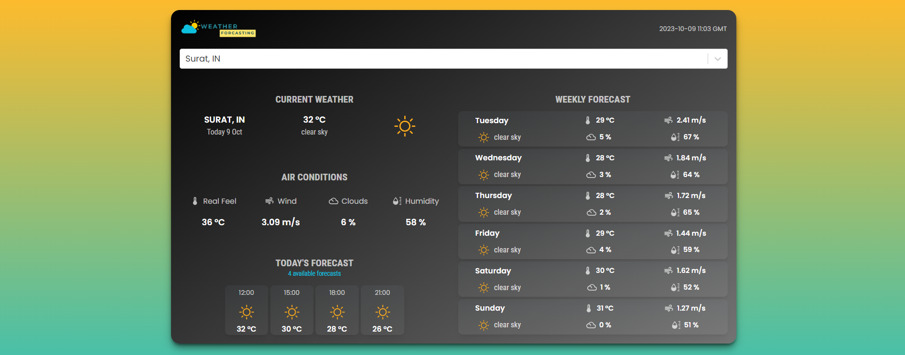

# ⛅️ Weather Forecasting App made with React

The Weather Forecasting allows users to look for locations by city name and view the weather for the subsequent 5–6 days and every three hours.

React.js and Material-UI are used to create the app.

## About

This is a personal project built in my spare time for learning purposes.


## ✨ Getting Started

- Verify that `Node.js` and `npm` are already installed on your system.
-  From [OpenWeatherMap](https://openweathermap.org/), you require an API key. Grab your key after registering an account at https://   home.openweathermap.org/api_keys.
- Then, under the `api/OpenWeatherService` section of the`src` directory, replace `WEATHER_API_KEY` with your OpenWeatherMap API Key.
-**`api/OpenWeatherService.js`**`: This file contains the program code for the application's back end.

## ⚡ Install

- Clone the repository:

```bash
git clone https://github.com/khushbu5794/react-weather-forecasting.git
```
- Install the packages using the command `npm install`

## 📙 Used libraries

- `react-js`
- `material-ui`

Check `packages.json` for details

## Author

👤 **Khushbu Patel**

- Linkedin:   [@Khushbu Patel](https://www.linkedin.com/in/khushideveloper)
- Instagram:  [@JyotDev](https://instagram.com/jyot_dev)